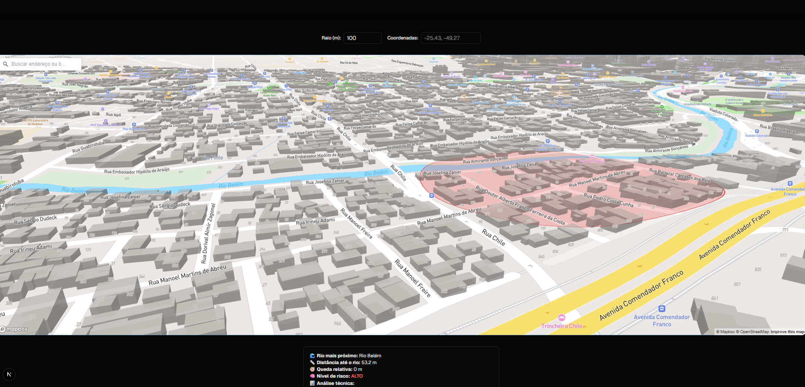

# 🌍 GeoRisk Frontend

Interface interativa do **GeoRisk**, um sistema de análise geográfica e ambiental com foco em risco de alagamento urbano e declividade do terreno.

---

## 🚀 Sobre o projeto

O **GeoRisk Frontend** foi desenvolvido com **Next.js + React + Mapbox GL JS** para visualização geográfica em tempo real.  
Ele se conecta à API do GeoRisk (FastAPI backend) para processar dados espaciais e exibir o **nível de risco** de um ponto ou área no mapa.

A aplicação é capaz de:
- Mostrar **mapas 3D** com terreno, prédios e camadas de análise.
- Selecionar pontos manualmente no mapa.
- Analisar áreas a partir de um **raio configurável** (em metros).
- Buscar **endereços** via campo de pesquisa (Mapbox Geocoder).
- Exibir explicações técnicas da IA com base nos dados retornados pela API.

---

## 🧠 Stack principal

| Categoria | Tecnologias |
|------------|--------------|
| **Framework** | [Next.js 14](https://nextjs.org/) + React 18 |
| **Mapa** | [Mapbox GL JS](https://docs.mapbox.com/mapbox-gl-js/guides/) + @turf/turf |
| **Design System** | [Shadcn/UI](https://ui.shadcn.com/) + TailwindCSS |
| **IA e Dados** | Integração com API GeoRisk (FastAPI) |
| **Build** | TypeScript + Vite (Turbopack no dev) |

