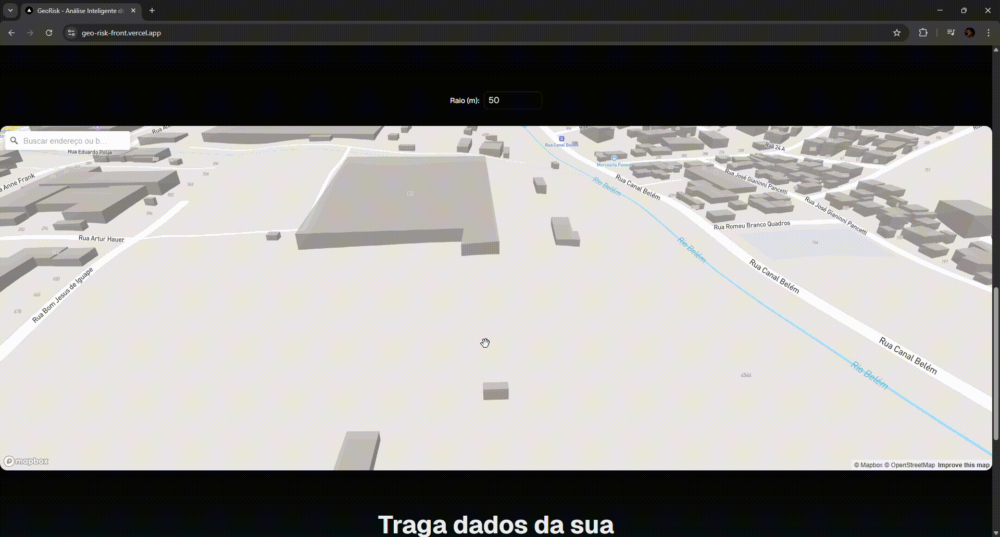

# 🌍 GeoRisk Frontend - [Acesse aqui!](https://geo-risk-front.vercel.app/)


<div align="center">
    <a href="https://git.io/typing-svg">
    
  </a>
</div>


---

## 🚀 Sobre o projeto 
Interface interativa do GeoRisk, um sistema de análise geográfica e ambiental com foco em risco de alagamento e declividade do terreno. Foi desenvolvido com **Next.js + React + Mapbox GL JS** para visualização geográfica em tempo real. Ele se conecta à API do GeoRisk (FastAPI backend) para processar dados espaciais e exibir o **nível de risco** de um ponto ou área no mapa.

A aplicação é capaz de:
- Mostrar **mapas 3D** com terreno, prédios e camadas de análise.
- Selecionar pontos manualmente no mapa.
- Analisar áreas a partir de um **raio configurável** (em metros).
- Buscar **endereços** via campo de pesquisa (Mapbox Geocoder).
- Exibir explicações técnicas da IA com base nos dados retornados pela API.

---

## 🧠 Stack principal

| Categoria | Tecnologias |
|------------|--------------|
| **Framework** | [Next.js 14](https://nextjs.org/) + React 18 |
| **Mapa** | [Mapbox GL JS](https://docs.mapbox.com/mapbox-gl-js/guides/) + @turf/turf |
| **Design System** | [Shadcn/UI](https://ui.shadcn.com/) + TailwindCSS |
| **IA e Dados** | Integração com API GeoRisk (FastAPI) |
| **Build** | TypeScript + Vite (Turbopack no dev) |

---

## ⚙️ Instalação e uso

### 1️⃣ Clone o repositório
```bash
git clone https://github.com/seuusuario/georisk-frontend.git
cd georisk-frontend
````

### 2️⃣ Instale as dependências

```bash
npm install
```

### 3️⃣ Configure o ambiente

Crie um arquivo `.env.local` na raiz com as seguintes variáveis:

```bash
NEXT_PUBLIC_MAPBOX_TOKEN=pk.sua_chave_do_mapbox
NEXT_PUBLIC_API_BASE_URL=http://127.0.0.1:8000
```

> 🔑 Para gerar o token do Mapbox:
> [https://account.mapbox.com/access-tokens/](https://account.mapbox.com/access-tokens/)

### 4️⃣ Rode o projeto

```bash
npm run dev
```

Acesse em:
👉 [http://localhost:3000](http://localhost:3000)

---

## 🗺️ Principais recursos

* **Mapa 3D com terreno e prédios**
* **Campo de busca de endereços**
* **Seleção de ponto via clique**
* **Input de coordenadas manuais**
* **Ajuste dinâmico de raio de análise**
* **Cálculo de risco via IA**
* **Exibição detalhada de análise técnica**

---

## 📁 Estrutura de pastas

```
georisk-frontend/
│
├── app/                    # Páginas do Next.js
├── components/             # Componentes reutilizáveis
│   ├── GeoRiskMap.tsx      # Mapa interativo principal
│   ├── DemoSection.tsx     # Landing page de teste rápido
│   └── ui/                 # Componentes Shadcn/UI
│
├── lib/                    # Funções auxiliares
│   └── api.ts              # Conexão com backend
│
├── public/                 # Imagens e ícones
├── styles/                 # Arquivos CSS/Tailwind
└── .env.local.example      # Exemplo de variáveis de ambiente
```

---

## 🤝 Integração com o backend

O frontend se comunica com o **GeoRisk API** (FastAPI) via endpoints:

| Endpoint        | Método | Função                                                                      |
| --------------- | ------ | --------------------------------------------------------------------------- |
| `/geo/risk`     | `POST` | Recebe um polígono (ou ponto com raio) e retorna o nível de risco calculado |
| `/geo/distance` | `POST` | (opcional) Cálculo direto de distância entre áreas                          |
| `/ai/ask-ai`    | `POST` | (opcional) Consulta direta à IA de análise contextual                       |

> 🔗 Repositório backend: [georisk-backend](https://github.com/GuilhermeSerafim/geo-risk)

---

## 🧩 Melhorias futuras

* [ ] Exibir **heatmap de risco** com gradiente
* [ ] Adicionar **modo noturno** sincronizado com o mapa
* [ ] Implementar **cache local de análises**
* [ ] Exibir histórico de pontos consultados
* [ ] Exportar relatórios em PDF

---

## 👨‍💻 Autor

Desenvolvido por **Guiler**
📍 Curitiba – Brasil
💼 [LinkedIn](https://www.linkedin.com/in/guiserafim)


